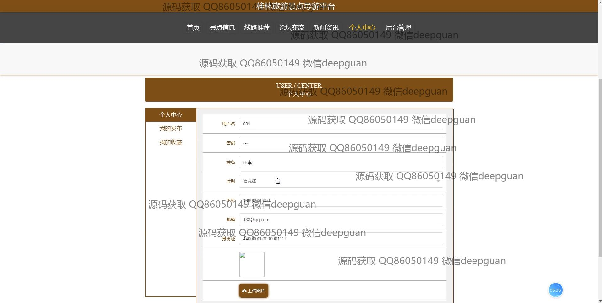

<h1 align="center">桂林旅游景点导游平台</h1>

## 简介
桂林旅游景点导游平台：提供管理员和用户角色，涵盖景点信息管理、线路推荐、用户交流、旅游订单管理等功能，支持在线预订和个性化导游服务。    --计算机毕业设计源码；毕设源码；java毕业设计源码

## 联系方式

<h3 align="center">获取完整代码与数据库文件 + 微信：deepguan QQ: 86050149 QQ群: 783742310</h3>

<h3 align="center">可帮忙远程部署 包运行成功！提供远程部署、修改代码、设计文档指导、代码讲解等服务！</h3>

## 功能介绍（完整见运行截图）
管理员： 基本功能包括登录、注册、退出，同时可以访问导航菜单和管理后台。管理员可进行用户管理、景点信息的添加和编辑、景点类型管理、线路推荐管理、订单信息管理、轮播图管理、论坛交流管理及系统设置等操作。管理员浏览界面简明易用，支持上传图片和编辑详细信息，帮助高效更新和管理平台内容。

用户： 基本功能包括登录、注册和退出。用户可以通过导航菜单浏览景点信息、推荐路线及新闻资讯。用户个人中心提供修改个人信息、查看和管理订单、发布内容及收藏的功能。用户还可以利用论坛参与交流、分享旅游体验，使用搜索功能查找特定景点，查看详细介绍和游客评价，并使用在线预约导游服务计划行程。

## 运行截图

本代码来源于网络,仅供学习参考使用!

